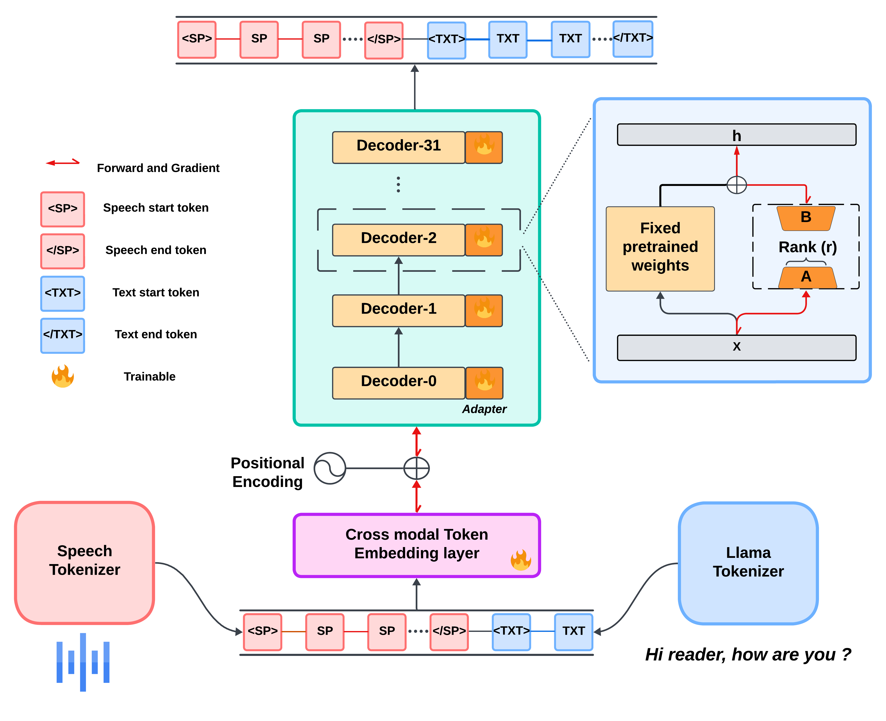

# **LaRA**  


## Overview
This repository contains the code for the paper **LaRA: Large Rank Adaptation for Speech and Text Cross-Modal Learning in Large Language Models** in EMNLP-2024 Findings.

### Abstract
Integrating speech and text capabilities into large language models (LLMs) is a challenging task, and we present Large Rank Adaptation (LaRA) for effective cross-modal integration of speech and text in the LLM framework. Unlike conventional LoRA, our method requires significantly larger ranks comparable to the pretrained weights to accommodate the complexities of speech-text cross-modality learning. The approach utilizes HuBERT to convert speech into discrete tokens and fine-tunes the pretrained LLM to adapt to cross-modal inputs and outputs. 

---

## 🛠️ **Model Architecture**

The architecture below provides a visual breakdown of the core components of the model:



**Architecture Details**:

1. **Token Conversion**: Convert speech input into discrete tokens using HuBERT.
2. **Embedding Resizing**: Integrate speech tokens into Llama-2 7B by resizing the embedding layer.
3. **Data modeling**: Form input sequences that alternate between speech and text tokens.
4. **Training**: Train the model to predict the next token, utilizing Large Rank Adaptation (LaRA) for effective learning.
And we show our findings in the paper.

---

## 📂 **Directory Structure**
```
LaRA/
├── model
│   ├── adapter_config.py
│   ├── model.py
│   ├── transfer_learning.py
├── speech2unit/
│   ├── dailytalk_modelling.ipynb
│   ├── librispeech_modelling.ipynb
│   ├── speech2unit.py
│   ├── speech2unit.ipynb
├── unit2speech/
├── train_LaRA.ipynb
├── requirements.txt
├── README.md
└── LICENSE```


# Setup Instructions for LaRA Environment for speech2unit dataset modeling

```bash
# Create and activate the conda environment
conda create --name LaRA python=3.10.14 -y
conda activate LaRA
pip install ipykernel #You may need this is when you run everything is in jupyter notebook
# If your notebook suggest re-installing ipykernel again manually using install button, that pops up? please do it!

# Below packages are for the models we download and play with!
%pip install torch transformers peft
%pip install -U bitsandbytes

# Check pip version, downgrade if necessary, and continue installation
pip --version
%pip install pip==24.0  # Run this only if pip version is 24.1 or higher
# Install the remaining packages
%pip install joblib fire
%pip install fairseq
%pip install soundfile einops scikit-learn
```

## 📑 Cite This Work
If you find this work useful, please consider citing our paper:

```bibtex
soon
```
